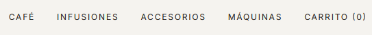
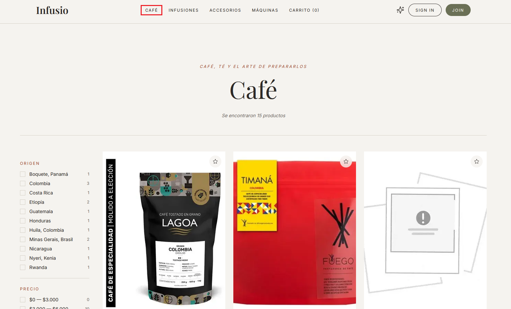
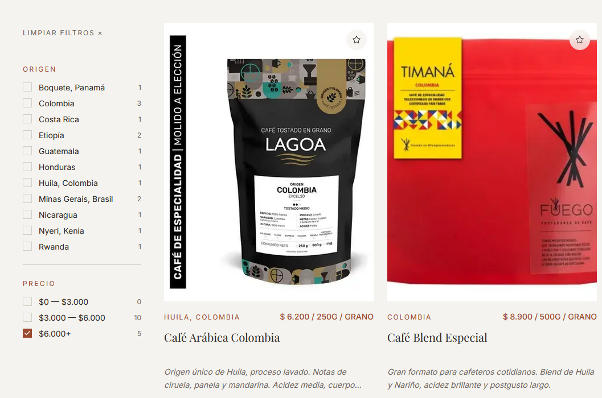
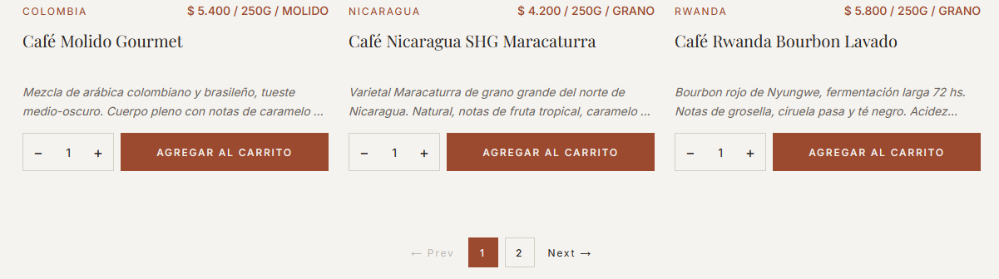

# Catálogo y búsqueda

## 1. Página de inicio

Al abrir la aplicación sin ningún filtro activo, se muestra la página de inicio con secciones editoriales: un hero de bienvenida, una sección de ritual matutino, tarjetas de características y una franja de edición limitada.

*Vista de la página de inicio con las secciones editoriales.*

---

## 2. Navegar por categoría

Para ver los productos de una categoría, hacé clic en uno de los links de la barra de navegación superior:

- **CAFÉ** — todos los cafés de especialidad
- **INFUSIONES** — yerbas, tés y tereré
- **ACCESORIOS** — mates, bombillas, termos y combos
- **MÁQUINAS** — cafeteras, prensas, molinillos y herramientas de barista

Al hacer clic, la página muestra la grilla de productos de esa categoría junto con la barra lateral de filtros.

*Los cuatro links de categoría en la parte superior de la página.*

*Grilla de productos de la categoría seleccionada con imagen, nombre, precio y origen.*

---

## 3. Filtros de la barra lateral

Una vez dentro de los resultados de búsqueda, aparece una barra lateral izquierda con tres tipos de filtros:

### Origen
Permite filtrar por el lugar de producción del producto (por ejemplo: Corrientes, Etiopía, Colombia). Se pueden seleccionar **múltiples orígenes** al mismo tiempo haciendo clic en cada uno.

### Tipo
Filtra por subcategoría dentro de los resultados (por ejemplo: dentro de "yerba mate" podés filtrar por "saborizadas"). También admite **selección múltiple**.

### Rango de precio
Filtra por franja de precio. Solo se puede seleccionar **una franja a la vez**.

*Barra lateral con filtros de origen, tipo y precio. Los filtros activos se muestran destacados.*

---

## 4. Limpiar filtros

Para eliminar todos los filtros aplicados, hacé clic en el botón **"Limpiar filtros"** que aparece en la parte superior de la barra lateral cuando hay al menos un filtro activo.

*El botón "Limpiar filtros" solo aparece cuando hay filtros activos.*

---

## 5. Paginación

Si hay más de 12 productos en los resultados, aparecen controles de paginación en la parte inferior de la grilla. Hacé clic en el número de página o en las flechas para navegar.

*Controles de paginación. La página actual se muestra resaltada.*
