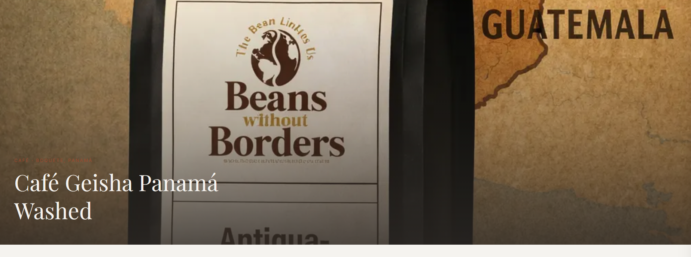
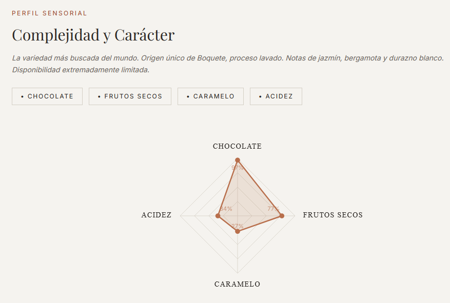
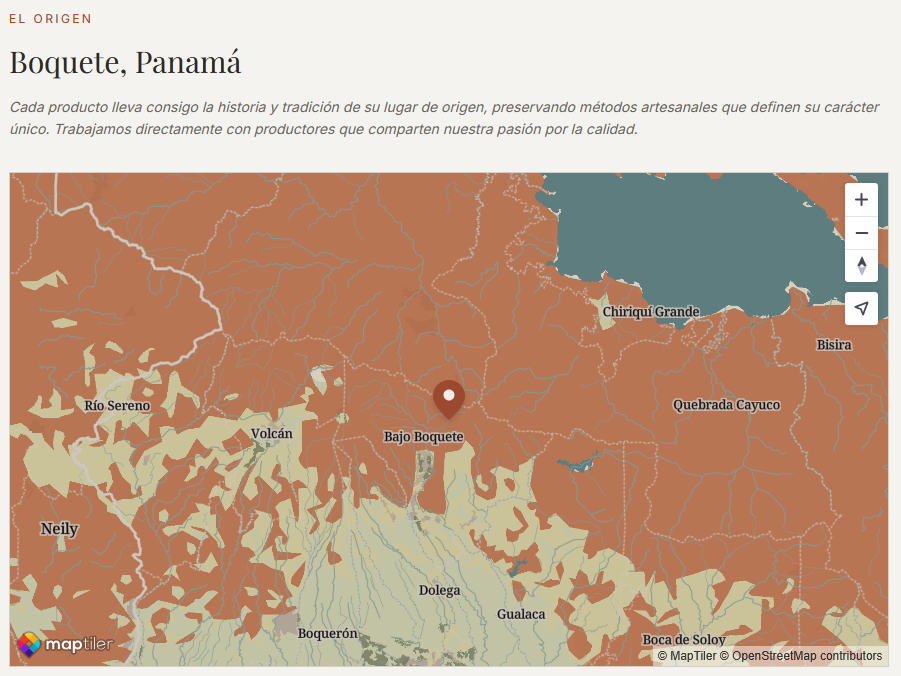
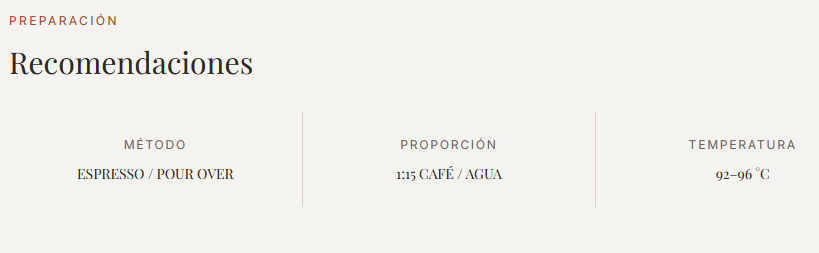
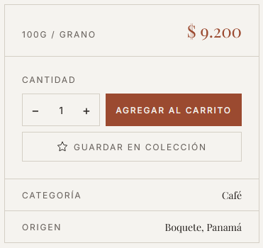
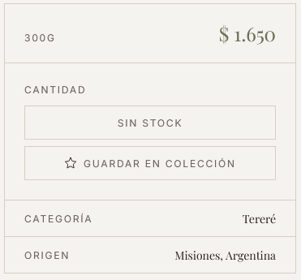
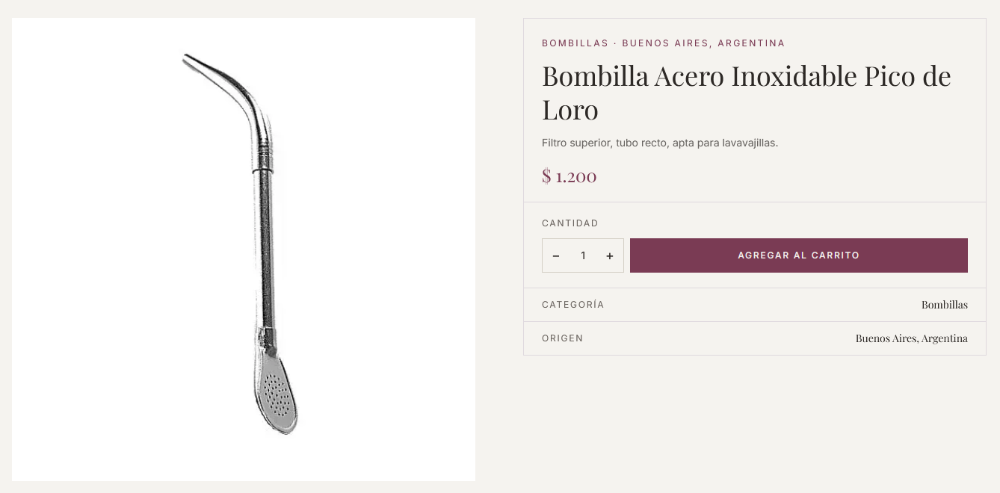
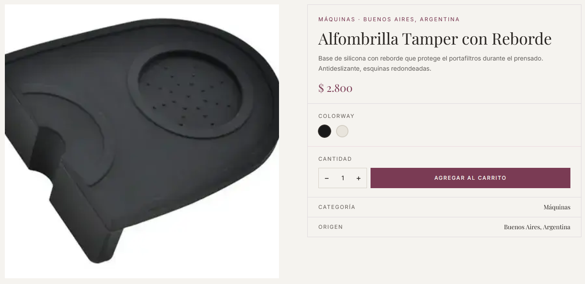
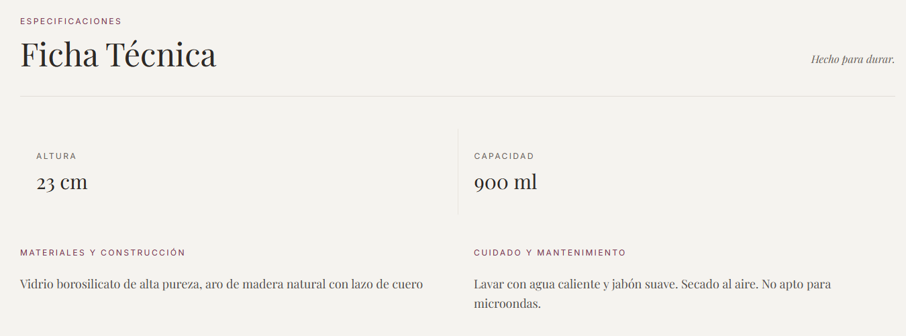

# Ficha de producto

Hay dos tipos de ficha según la categoría del producto: **consumibles** (café, yerba, tés, tereré) y **accesorios y máquinas** (mates, bombillas, termos, máquinas de café).

---

## Productos consumibles (café, yerba, tés, tereré)

### Estructura de la página

Al hacer clic en cualquier producto consumible desde el catálogo, se abre su ficha con las siguientes secciones:

**Hero (imagen de fondo):** Imagen del producto a pantalla completa con el nombre y la categoría superpuestos.

*Vista del hero con el nombre del producto y su origen en la parte inferior izquierda.*

---

**Perfil Sensorial:** Etiquetas de sabor (por ejemplo: CHOCOLATE, ACIDEZ, FLORAL) y un gráfico radial que ilustra las características del producto.

*Gráfico radial y etiquetas de perfil sensorial.*

---

**El Origen:** Mapa interactivo que muestra la región de producción del producto.

*Mapa de la región de origen. El marcador señala el lugar de producción.*

---

**Preparación:** Tarjetas con el método de preparación recomendado, la proporción y la temperatura ideal.

*Método, proporción y temperatura según el tipo de producto.*

---

**Panel de compra (lateral derecho):** Precio, unidad, selector de cantidad, botón para agregar al carrito y botón de favorito.

*Panel con precio, cantidad y botón "Agregar al carrito". Si el producto no tiene stock, el botón aparece desactivado.*

> **Sin stock:** Si el producto está agotado, el botón de compra dice "SIN STOCK" y no puede presionarse.

*El botón aparece desactivado cuando el stock es 0.*

---

## Accesorios y máquinas (mates, bombillas, termos, máquinas)

La ficha de accesorios tiene un diseño diferente, con la imagen a la izquierda y el panel de compra a la derecha.

*Diseño 50/50: imagen cuadrada a la izquierda, panel de compra a la derecha.*

---

**Variantes de color:** Algunos productos muestran círculos de color para elegir entre variantes disponibles.

*Selector de colores. El color activo aparece con borde resaltado.*

---

**Ficha Técnica:** Si el producto tiene especificaciones, se muestra una sección con dimensiones (altura, diámetro, peso, etc.), materiales y cuidado y mantenimiento.

*Dimensiones en grilla y texto de materiales y cuidado.*

