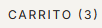
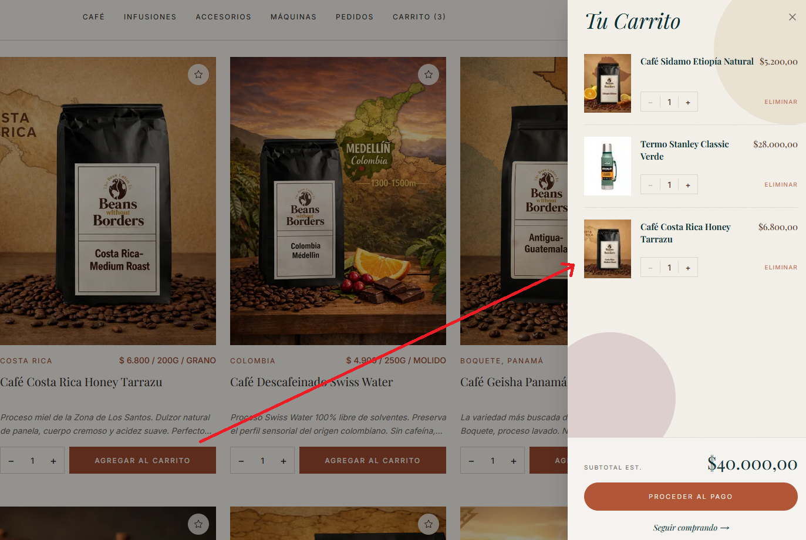
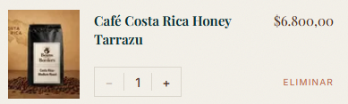
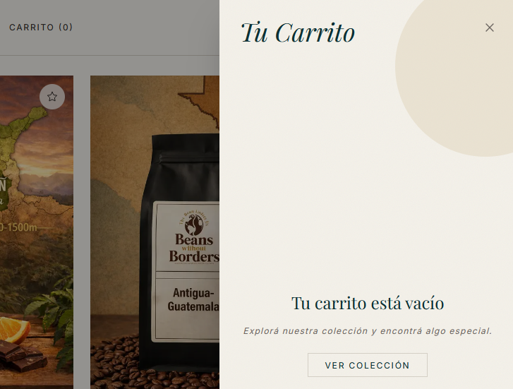
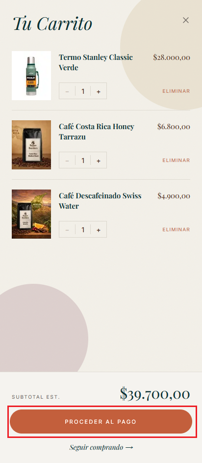

# Carrito de compras

## 1. Agregar un producto al carrito

Desde la ficha de cualquier producto:

1. Usá el selector de cantidad (`−` y `+`) para elegir cuántas unidades querés.
2. Hacé clic en **"AGREGAR AL CARRITO"**.
3. Al agregarlo, se activa una animación: una miniatura del producto vuela hacia el ícono del carrito en la barra de navegación.

*Selector de cantidad y botón de agregar al carrito en el panel de compra.*

> **Si no estás logueado:** La app te redirige automáticamente a la pantalla de inicio de sesión. Una vez que iniciás sesión, el producto queda guardado y se agrega al carrito sin tener que repetir el proceso.

---

## 2. Abrir el carrito

Hacé clic en **carrito** en la barra de navegación superior derecha para abrir el panel lateral del carrito.

*El ícono muestra un badge con la cantidad de ítems en el carrito.*

---

## 3. Panel lateral del carrito

El panel lateral muestra todos los productos agregados con su imagen, nombre, variante (unidad), precio unitario y controles de cantidad.

*Panel lateral con los productos del carrito, subtotal y botón de checkout.*

---

## 4. Modificar la cantidad o eliminar un ítem

Dentro del panel lateral, cada ítem tiene botones `−` y `+` para cambiar la cantidad:

- Presionar `+` suma una unidad.
- Presionar `−` resta una unidad. No se puede restar más al llegar a 1 item.
- Para eliminar el producto directamente sin reducir de a uno, hacé clic en el **ícono de papelera** que aparece junto al ítem.

*Botones de suma, resta y eliminación por producto.*

---

## 5. Carrito vacío

Si el carrito no tiene productos, el panel muestra un mensaje de carrito vacío con un enlace para ir al catálogo.

*Vista del panel cuando no hay ítems en el carrito.*

---

## 6. Ir al checkout

En la parte inferior del panel lateral aparece el **subtotal** y el botón **"IR A PAGAR"**. Al presionarlo, se abre la página completa del carrito (`/cart`) donde comienza el proceso de compra.

*Subtotal y botón para continuar con el proceso de compra.*
