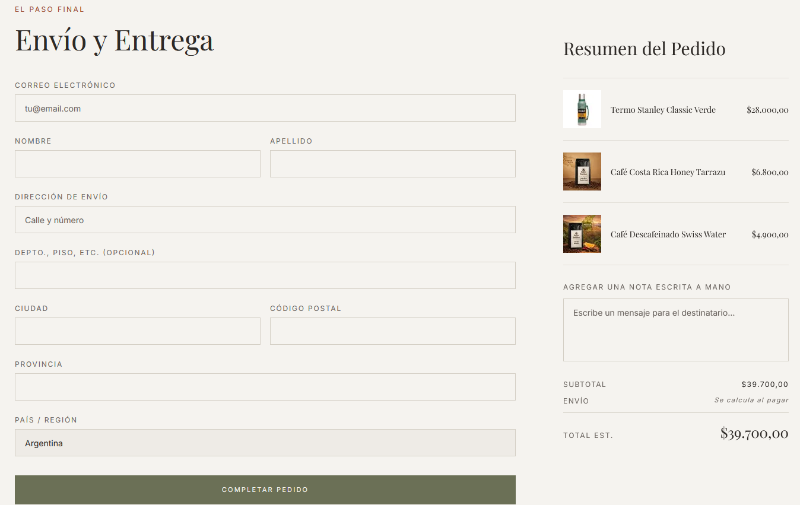
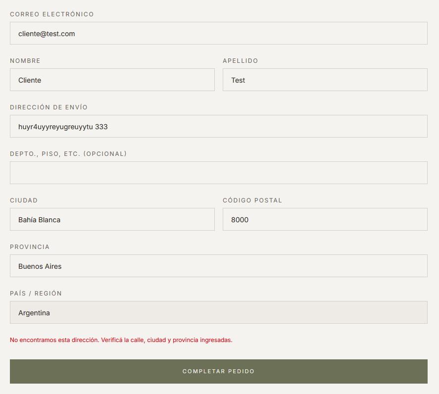
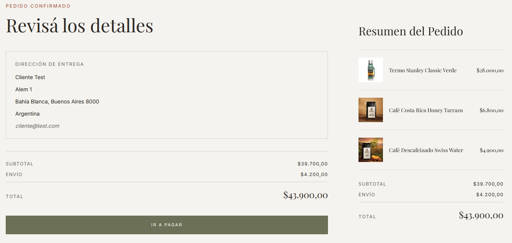
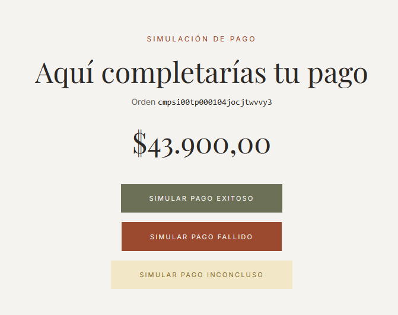
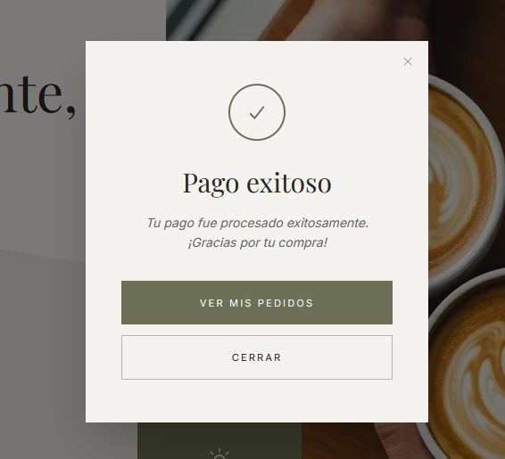
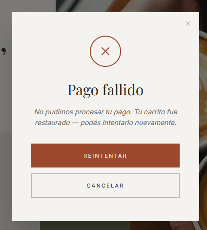
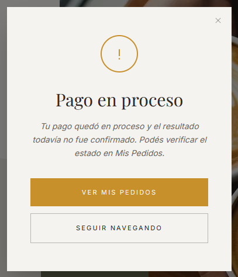

# Checkout y pago

El proceso de compra tiene dos pasos: **confirmar la dirección** y **revisar y pagar la orden**.

---

## Paso 1 — Dirección de entrega

Al llegar a la página del carrito, se muestra el formulario de dirección de entrega.

*Formulario con los campos de dirección. Los campos obligatorios marcaran cuando falte completar.*

### Campos del formulario

| Campo | Obligatorio |
|-------|-------------|
| Email | Sí |
| Nombre | Sí |
| Apellido | Sí |
| Calle y número | Sí |
| Piso / departamento | No |
| Ciudad | Sí |
| Código postal | Sí |
| Provincia | Sí |
| País | Fijo: Argentina |
| Nota para el destinatario | No |

### Validación de dirección

Al enviar el formulario, la app verifica que la dirección exista geográficamente en Argentina. Si la dirección no se puede encontrar, aparece un mensaje de error.

*Mensaje de error cuando la dirección no puede validarse.*

---

## Paso 2 — Resumen de la orden

Si la dirección es válida, se muestra un resumen con:

- La dirección de entrega confirmada
- El detalle de los productos (nombre, cantidad, precio)
- El costo de envío calculado
- El total a pagar (subtotal + envío)

*Vista del resumen de la orden con todos los costos desglosados.*

Hacé clic en el botón **"IR A PAGAR"** para confirmar la orden y ser redirigido al procesador de pagos **Mercado Pago**.

---

## Simulación de pago (entorno de desarrollo)

Como la app usa un procesador de pagos simulado en lugar de Mercado Pago real, al llegar al paso de pago se muestra una página de simulación con el número de orden y el total.

Desde ahí podés elegir el resultado del pago con uno de los tres botones:

*Pantalla de simulación con los tres botones de resultado.*

---

### SIMULAR PAGO EXITOSO

La app muestra un modal de confirmación y la orden queda en estado **CONFIRMADO**.

*Modal de éxito con confirmación de la compra.*

---

### SIMULAR PAGO FALLIDO

La app:

1. Restaura automáticamente los productos al carrito.
2. Muestra un modal informando que el pago no se realizó.
3. Los productos vuelven a estar disponibles para intentarlo de nuevo.

*Modal de fallo con indicación de que el carrito fue restaurado.*

---

### SIMULAR PAGO INCONCLUSO

La orden queda en estado **PENDIENTE**. El usuario puede reintentar el pago desde la sección de pedidos.

*Modal de pago inconcluso con indicación del estado pendiente.*

