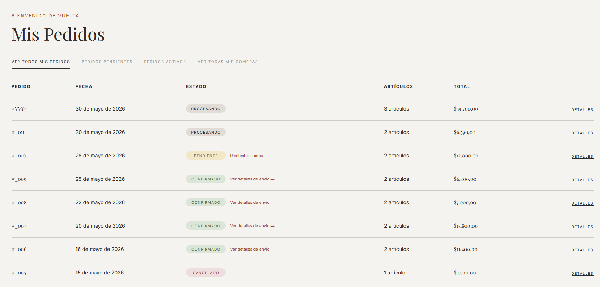
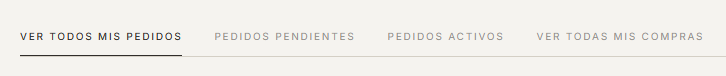
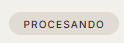
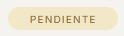
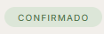
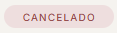
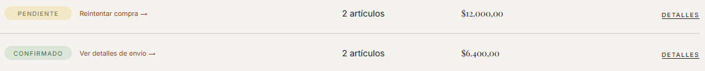

# Mis pedidos

Para ver el historial de órdenes, hacé clic en **"Mis pedidos"** en el menú de navegación o accedé directamente a `/orders`.

> Es necesario estar logueado para ver esta sección.

*Lista de todas las órdenes con sus estados, fechas y totales.*

---

## Pestañas de filtrado

En la parte superior de la página hay cuatro pestañas para filtrar los pedidos:

| Pestaña | Qué muestra |
|---------|-------------|
| **VER TODOS MIS PEDIDOS** | Todas las órdenes sin excepción |
| **PEDIDOS PENDIENTES** | Solo las órdenes con estado PENDIENTE (pago no completado) |
| **PEDIDOS ACTIVOS** | Órdenes confirmadas que están en proceso de envío |
| **VER TODAS MIS COMPRAS** | Todas las órdenes confirmadas (entregadas e in-transit) |

*Las pestañas permiten filtrar el historial por estado.*

---

## Estados de una orden

Cada orden tiene un badge de color que indica su estado actual:

### PROCESANDO (beige/tan)
La orden fue creada pero el pago todavía no fue confirmado por el sistema.

### PENDIENTE (dorado)
Se generó un link de pago pero el usuario no completó la transacción en Mercado Pago. **Acción disponible:** botón para reintentar el pago.

### CONFIRMADO (verde)
El pago fue procesado correctamente y la orden está siendo preparada o enviada. **Acción disponible:** link para ver el seguimiento del envío (si aplica).

### CANCELADO (rojo)
La orden fue cancelada, ya sea antes o después del pago.

---

## Acciones disponibles por orden

Desde la lista de órdenes, cada fila tiene acciones rápidas según el estado:

- **Cualquier estado:** botón **"DETALLES"** para ver la página completa de la orden.
- **PENDIENTE:** botón **"Reintentar compra"** que redirige al link de pago original.
- **CONFIRMADO con envío activo:** link **"Ver detalles de envío"** que abre el **Shipping App** externo en una nueva pestaña, donde podés ver el estado detallado del envío y el seguimiento en tiempo real.

*Botones de acción que aparecen según el estado de cada orden.*

