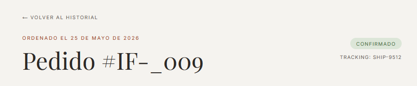
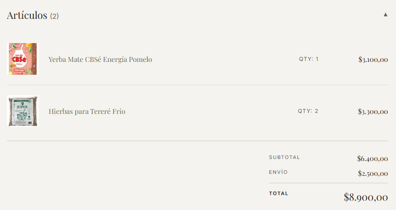
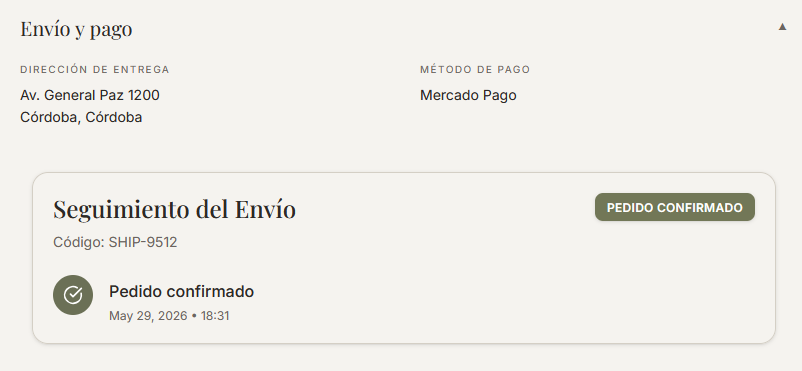
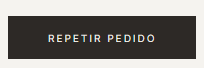
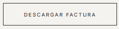

# Detalle de una orden

Hacé clic en el botón **"DETALLES"** de cualquier orden para ver su página completa.

---

## Encabezado

La parte superior muestra el número de orden (formato `#INF-XXXX`), la fecha de creación, el badge de estado y, si el envío fue generado, el código de seguimiento.

*Número de orden, fecha, estado y código de envío en el encabezado.*

---

## Sección: Artículos

La sección de artículos está abierta por defecto y muestra el detalle completo de los productos comprados:

- Miniatura de imagen
- Nombre del producto y variante (unidad)
- Cantidad y precio unitario
- Total de la línea

Al final de la lista se desglosa el **subtotal**, el **costo de envío** y el **total general**.

*Lista de productos con precios unitarios y totales.*

Hacé clic en el encabezado **"Artículos"** para expandir o colapsar esta sección.

---

## Sección: Envío y pago

Esta sección contiene la dirección de entrega, el método de pago (siempre Mercado Pago), el ID de operación y, si la orden tiene un envío asignado, el panel de seguimiento en tiempo real integrado desde el **Shipping App**.

*Dirección de entrega, datos del pago y panel de seguimiento del envío.*

Hacé clic en el encabezado para expandir o colapsar esta sección.

> **Nota:** La app está conectada al Shipping App real, por lo que la mayoría de las órdenes confirmadas tienen un ID de envío válido y muestran el seguimiento. Sin embargo, hay 3 órdenes confirmadas en los datos de prueba que no tienen envío asignado — en esos casos la sección muestra solo la dirección y los datos del pago, sin el panel de seguimiento.

---

## Repetir pedido

El botón **"Repetir pedido"** (en la parte inferior de la página) agrega todos los artículos de esa orden nuevamente al carrito, permitiendo volver a comprar los mismos productos con un solo clic.

*El botón agrega todos los ítems de la orden al carrito actual.*

---

## Descargar factura

El link **"Descargar factura"** genera y descarga el comprobante de la compra en formato PDF.

*Link de descarga del comprobante de compra.*

