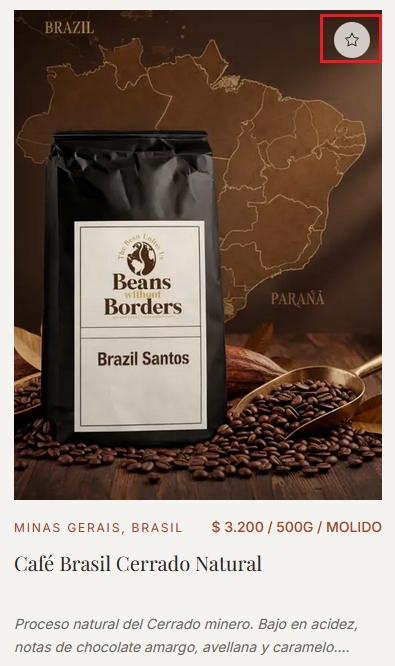
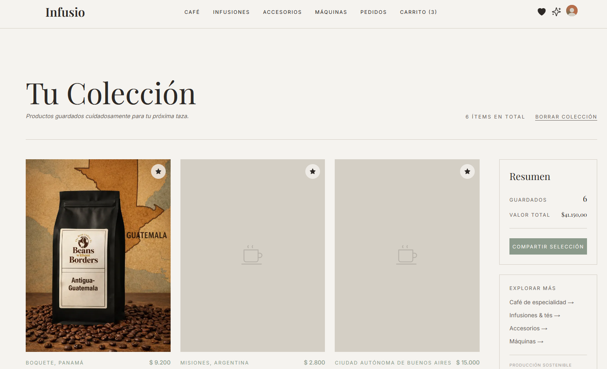
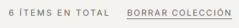
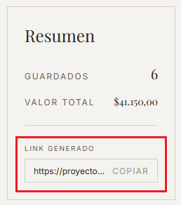
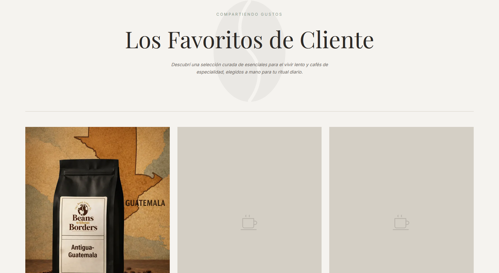

# Favoritos

## 1. Agregar un producto a favoritos

En la ficha de cualquier producto, hay un botón con un ícono de estrella. Hacé clic para guardar el producto en tu lista de favoritos.

- **Estrella vacía (contorno):** el producto no está guardado.
- **Estrella rellena:** el producto ya está en favoritos.

Al guardar, se activa una animación: la miniatura del producto vuela hacia el ícono de favoritos en la barra de navegación.

*La estrella pasa de contorno a relleno al guardar el producto.*

> Es necesario estar logueado para usar favoritos.

---

## 2. Ver la lista de favoritos

Hacé clic en el **ícono de corazón** en la barra de navegación para ir a `/favourites`.

La página muestra todos los productos guardados en una grilla con su imagen, nombre, precio y origen.

En la parte superior aparece:
- El **total de ítems** guardados.
- El **valor total** de todos los productos en la lista.

*Grilla de productos favoritos con resumen de cantidad y valor total.*

---

## 3. Eliminar un favorito

Para eliminar un producto de favoritos, volvé a hacer clic en la **estrella rellena** en la ficha del producto. La estrella vuelve a su estado de contorno y el producto se quita de la lista.

---

## 4. Vaciar la lista completa

Para eliminar todos los favoritos de una vez, hacé clic en el botón **"VACIAR LISTA"** en la parte superior de la página.

*El botón "VACIAR LISTA" elimina todos los favoritos de una sola vez.*

---

## 5. Ir al producto desde favoritos

Hacé clic en cualquier tarjeta de la lista para ir directamente a la ficha del producto.

---

## 6. Compartir tu selección

Hacé clic en el botón **"COMPARTIR SELECCIÓN"** para generar un enlace público con tu lista de favoritos actual.

1. Se genera un link único (por ejemplo: `...infusio.../favourites/share/abc123`).
2. Aparece un botón **"Copiar link"**.
3. Al hacer clic, el texto del botón cambia a **"¡COPIADO!"** por un instante para confirmar.

*El link se genera y el botón da feedback visual al copiarse.*

---

## 7. Ver una lista compartida

Cualquier persona que reciba el link puede ver la selección sin necesidad de estar registrada. La página muestra:

- El título **"Los Favoritos de [Nombre]"**, donde [Nombre] es el nombre real del cliente que compartió la lista.
- Una grilla de productos de solo lectura.
- Un botón para ir al catálogo.

No se pueden agregar ni eliminar productos desde esta vista.

*Vista pública de la lista de favoritos compartida. Solo lectura, sin autenticación.*

