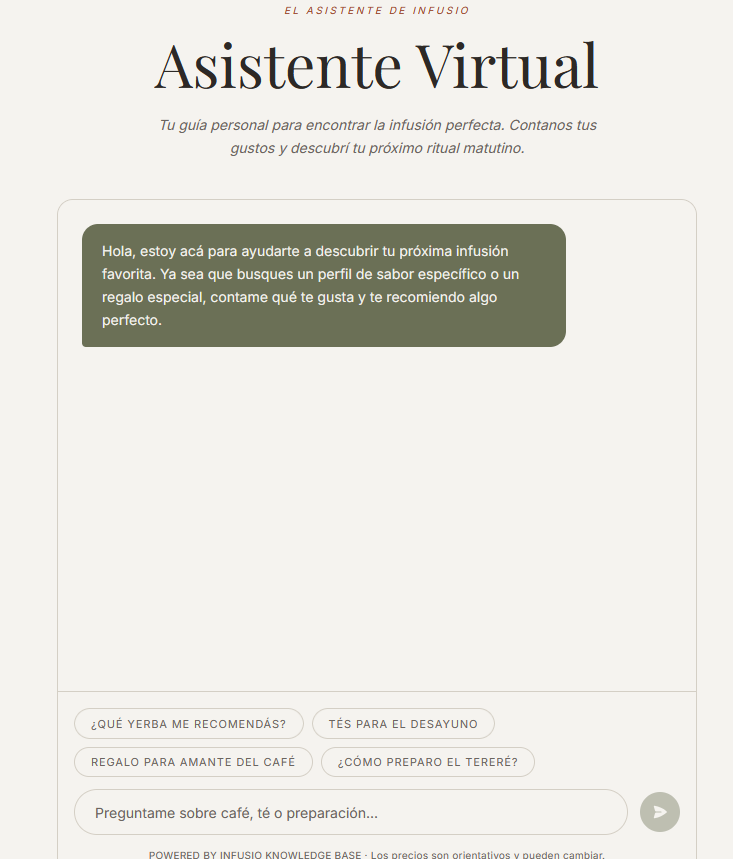
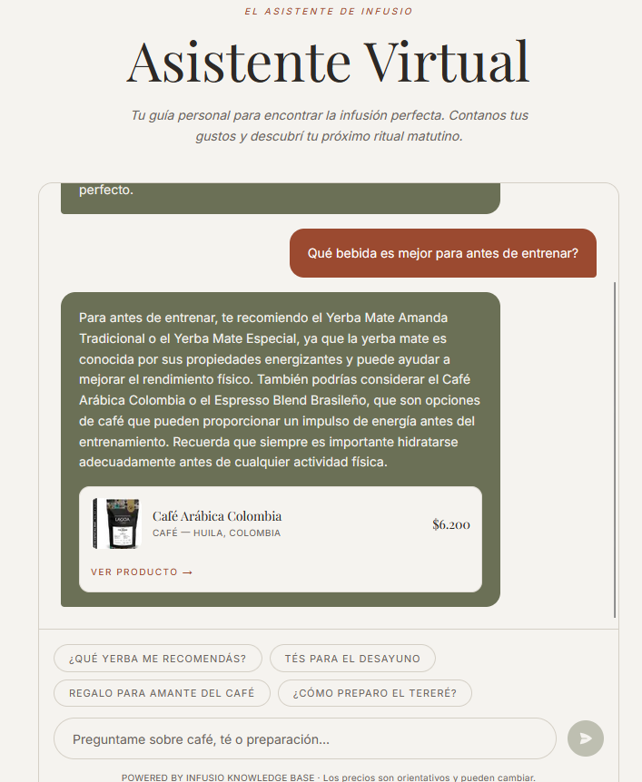

# Asistente virtual

## Cómo acceder

Hacé clic en el **ícono de estrella (✦)** en la barra de navegación superior para abrir el asistente virtual. También encontrás el link al asistente en el **footer** de la página.

*El ícono de estrella abre el asistente. Se rellena cuando estás en la página del asistente.*

---

## Pantalla inicial y chips de sugerencia

Al abrir `/assistant`, el asistente saluda y ofrece chips de sugerencia rápida para empezar la conversación sin necesidad de escribir nada:

- ¿Qué yerba me recomendás?
- Tés para el desayuno
- Regalo para amante del café
- ¿Cómo preparo el tereré?

Hacé clic en cualquier chip para enviarlo como mensaje. Los chips se desactivan mientras el asistente está procesando la respuesta.

*Saludo inicial y chips de inicio rápido. Se desactivan durante la carga.*

---

## Enviar un mensaje y ver la respuesta

1. Escribí tu pregunta en el campo de texto al final de la pantalla.
2. Presioná **Enter** o hacé clic en el botón de enviar (→).
3. Tu mensaje aparece en la derecha (fondo terracota); la respuesta del asistente aparece en la izquierda (fondo oliva).

Mientras el asistente procesa, aparece el indicador **"Escribiendo..."**.

Cuando el asistente recomienda un producto específico, la respuesta incluye una tarjeta con imagen, nombre, origen, precio y un botón **"VER PRODUCTO →"** para ir directamente a la ficha.

*Mensaje del usuario (derecha) y respuesta del asistente con tarjeta de producto (izquierda).*

---

## Qué puede hacer el asistente

- Recomendar productos según tus preferencias (sabor, momento del día, presupuesto)
- Explicar métodos de preparación (mate, café de filtro, tereré, etc.)
- Responder preguntas sobre los productos de la tienda
- Sugerir regalos o combos
