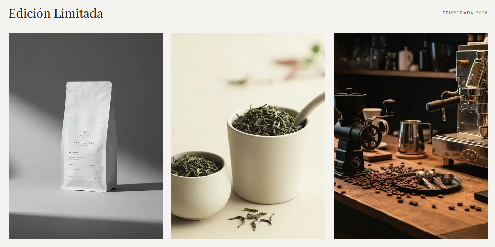
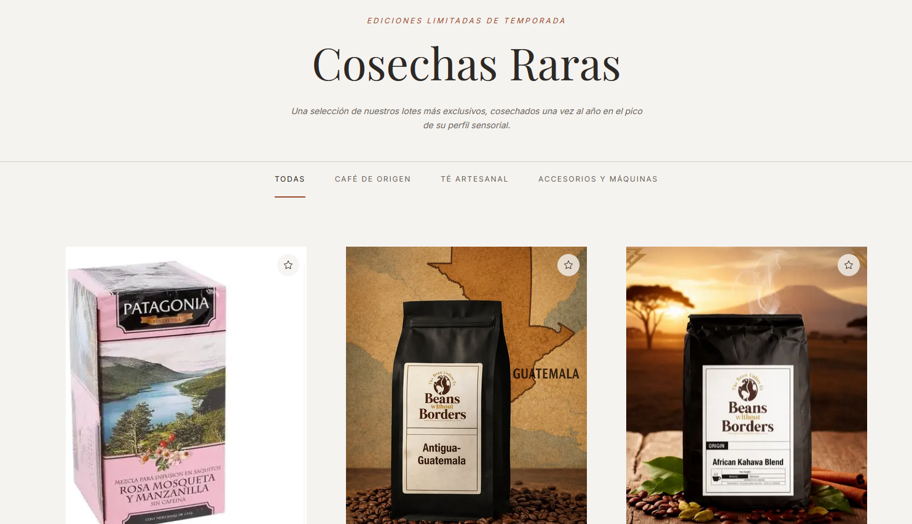
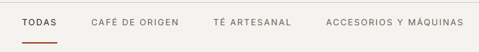

# Edición limitada

## Cómo acceder

Los productos de edición limitada son accesibles desde:

- La franja **"Edición Limitada"** en la página de inicio (scroll hacia abajo).
- El enlace **"Edición Limitada"** en el menú de navegación.

Ambos llevan a `/limited-edition`.

*La sección de edición limitada aparece en la página de inicio con acceso directo.*

---

## Página de edición limitada

La página muestra solo los productos con disponibilidad temporal, junto con la fecha límite hasta la que estarán disponibles.

*Grilla de productos de edición limitada con badges y fechas de vencimiento.*

---

## Pestañas de categoría

En la parte superior hay pestañas para filtrar por tipo de producto:

| Pestaña | Qué muestra |
|---------|-------------|
| **TODAS** | Todos los productos de edición limitada |
| **CAFÉ DE ORIGEN** | Solo los cafés de origen único |
| **TÉ ARTESANAL** | Solo los tés de edición especial |
| **ACCESORIOS Y MÁQUINAS** | Accesorios o máquinas de edición limitada |

*Las pestañas filtran los productos sin recargar la página.*

---

## Agregar al carrito

El proceso es idéntico al de los productos regulares:

1. Hacé clic en el producto para ver su ficha.
2. Seleccioná la cantidad.
3. Presioná **"AGREGAR AL CARRITO"**.
