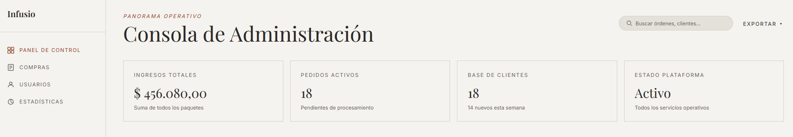
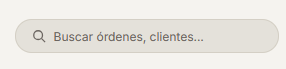
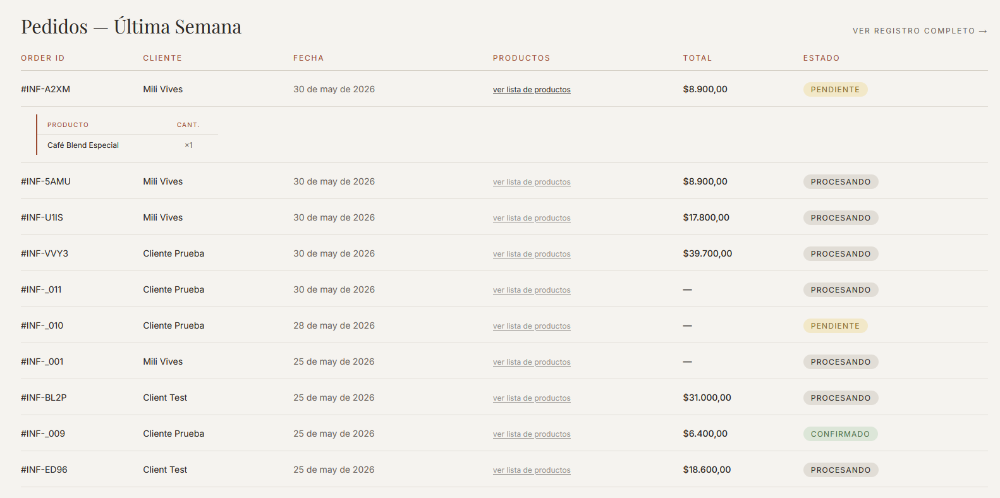
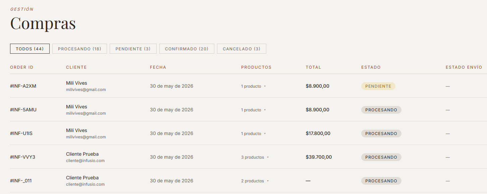
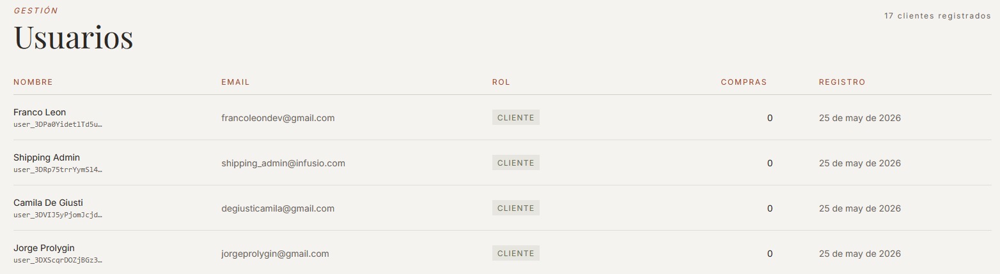
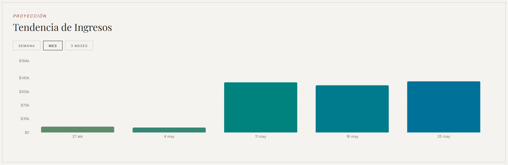
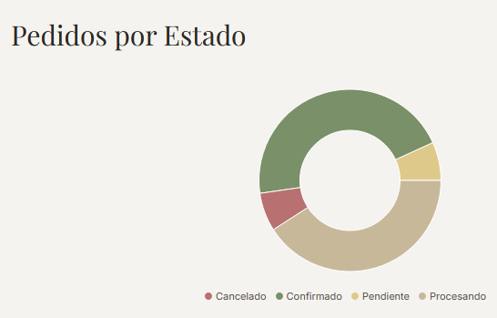
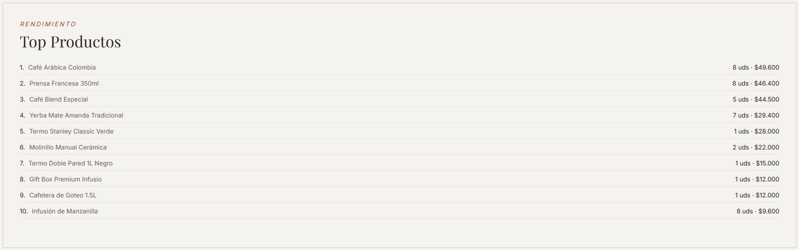
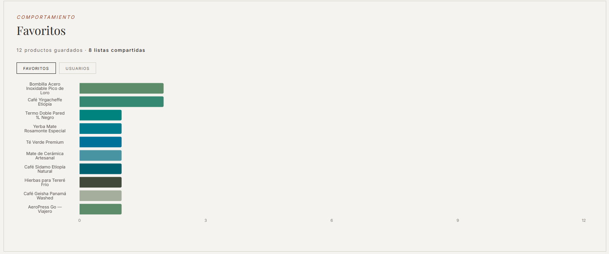

# Panel de administración

## Acceso

Iniciá sesión con la cuenta de administrador:

| Email | Contraseña |
|-------|------------|
| admin@infusio.com | Infusio2024! |

Luego accedé a `/admin` desde la URL o desde el link que aparece en el menú al estar logueado como admin.

---

## Dashboard principal (`/admin`)

### Tarjetas de métricas

La parte superior muestra cuatro indicadores clave:

- **Ingresos totales** — suma de todos los paquetes confirmados
- **Órdenes activas** — cantidad de órdenes en estado PROCESANDO
- **Base de clientes** — usuarios totales y nuevos esta semana
- **Estado de la plataforma** — estado operativo del sistema

*Las cuatro tarjetas de métricas en la parte superior del dashboard.*

---

### Buscador de órdenes

Podés buscar órdenes específicas ingresando:

- El ID de la orden (con o sin el prefijo `#INF-`)
- El nombre del cliente
- El email del cliente

Los resultados aparecen en la tabla inferior.

*Campo de búsqueda y tabla de resultados filtrados.*

---

### Tabla de órdenes recientes

Muestra las órdenes de los últimos 7 días (o los resultados del buscador). Columnas: ID, cliente, fecha, productos, total y estado.

En la columna **Productos**, hacé clic en **"ver lista de productos"** para expandir una mini-tabla con el detalle de los artículos de esa orden.

*La mini-tabla inline muestra nombre y cantidad de cada producto de la orden.*

---

## Compras (`/admin/purchases`)

Página con el historial completo de órdenes, filtrables por estado.

### Filtros por estado

Los botones en la parte superior filtran la tabla:

- **TODOS** — todas las órdenes
- **PROCESANDO** — en espera de confirmación de pago
- **PENDIENTE** — link de pago generado, pago no completado
- **CONFIRMADO** — pago exitoso, orden en envío
- **CANCELADO** — órdenes canceladas

Cada botón muestra el conteo de órdenes en ese estado.

*Los botones de filtro muestran la cantidad de órdenes en cada estado.*

La tabla incluye una columna adicional de **Estado de envío** que trae el estado en tiempo real del Shipping App para las órdenes con envío asignado.

---

## Usuarios (`/admin/users`)

Lista de todos los usuarios registrados con rol CLIENT.

Columnas: nombre (con ID de Clerk abreviado), email, rol, cantidad de compras y fecha de registro.

*Lista de usuarios con cantidad de compras y fecha de registro.*

---

## Analíticas (`/admin/analytics`)

La página de analíticas combina datos reales con análisis generado por IA (Gemini).

> **Nota:** Las secciones generadas por IA aparecen solo cuando Gemini devuelve una respuesta exitosa. Si no se muestran en el deploy, es porque la llamada a la IA no produjo resultado en ese momento.

### Plan de Acción Semanal

Lista de recomendaciones generadas por IA basadas en los datos actuales del negocio: ingresos, carritos abandonados, cancelaciones y productos más vendidos.

*Recomendaciones priorizadas generadas automáticamente. Solo aparece cuando Gemini devuelve una respuesta.*

---

### Gráfico de tendencia de ingresos

Gráfico de barras con los ingresos históricos. Tiene tres vistas seleccionables:

- **Diario** — últimos 7 días
- **Semanal** — últimas 5 semanas
- **Trimestral** — últimas 13 semanas

Incluye un análisis de IA sobre la tendencia observada.

*Gráfico de barras con selector de período y análisis de IA.*

---

### Distribución de estados de órdenes

Gráfico de torta que muestra la proporción de órdenes por estado (PROCESANDO, CONFIRMADO, CANCELADO, PENDIENTE).

*Torta de distribución de estados de órdenes.*

---

### Productos más vendidos

Lista de los productos con mayor cantidad de unidades vendidas y su ingreso total generado. Incluye análisis de IA.

*Los productos más vendidos con métricas de unidades e ingresos.*

---

### Carritos abandonados

Si existen carritos con ítems que no fueron comprados, esta sección muestra:

- Total de carritos abandonados
- Ingresos potenciales perdidos

---

### Analíticas de favoritos

- Cantidad total de productos guardados como favoritos
- Listas compartidas generadas
- Productos más guardados
- Categorías favoritas
- Análisis de IA sobre preferencias de los clientes

*Métricas de favoritos con insights generados por IA.*

---

### Anomalías Detectadas

Sección generada por IA que aparece **solo cuando se detectan patrones inusuales** en los datos del negocio (caídas de ventas, picos de abandono, etc.). Si todo está dentro de lo normal, esta sección no se muestra.

### Segmentación de clientes

Análisis de IA sobre los distintos tipos de clientes.
