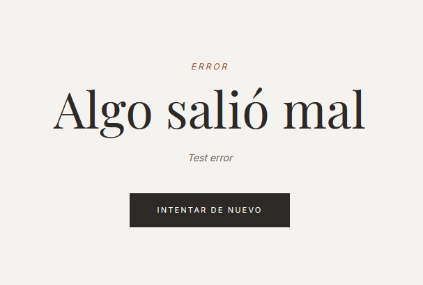

# Páginas de error

## Error 404 — Página no encontrada

Si el usuario intenta acceder a una URL que no existe, la app muestra una página de error 404 personalizada con el mensaje **"Página no encontrada"** y un botón para volver al inicio.

*Página 404 con botón "VOLVER AL INICIO".*

---

## Error de la aplicación

Si ocurre un error inesperado en tiempo de ejecución, la app muestra una pantalla de error con el mensaje del problema y un botón **"INTENTAR DE NUEVO"** que recarga el componente sin necesidad de recargar toda la página.

*Pantalla de error con botón para reintentar.*
