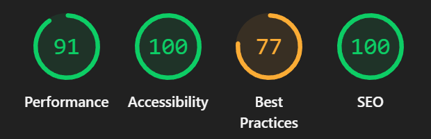

# Resultados Lighthouse

Lighthouse es la herramienta de auditoría de Google integrada en Chrome DevTools. Mide la calidad de la aplicación en cuatro categorías: **Performance**, **Accessibility**, **Best Practices** y **SEO**.

---

## Desktop

*Auditoría de la página en computadora.*

---

## Mobile

*Auditoría de la página en celular.*
